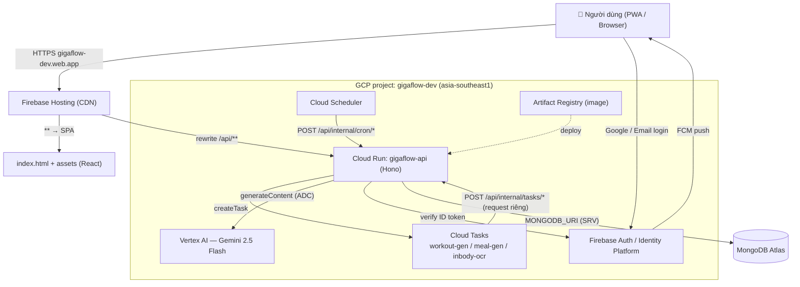
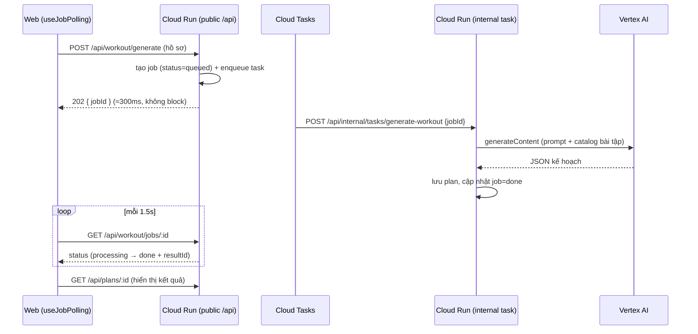

# BÁO CÁO DỰ ÁN — GigaFlow

> Ứng dụng tập luyện & dinh dưỡng cá nhân hoá bằng AI (web PWA + backend serverless trên Google Cloud).
> Repo: `uitbestteam/gigaflow` · Live: https://gigaflow-dev.web.app

---

## Mục lục
1. [Tổng quan](#1-tổng-quan)
2. [Mục tiêu & phạm vi](#2-mục-tiêu--phạm-vi)
3. [Công nghệ sử dụng](#3-công-nghệ-sử-dụng)
4. [Cấu trúc source code](#4-cấu-trúc-source-code)
5. [Kiến trúc hệ thống](#5-kiến-trúc-hệ-thống)
6. [Mô hình dữ liệu](#6-mô-hình-dữ-liệu)
7. [Tính năng chính](#7-tính-năng-chính)
8. [Chi tiết triển khai tiêu biểu (kèm source code)](#8-chi-tiết-triển-khai-tiêu-biểu-kèm-source-code)
9. [Hạ tầng & triển khai (DevOps)](#9-hạ-tầng--triển-khai-devops)
10. [Kiểm thử](#10-kiểm-thử)
11. [Kết quả](#11-kết-quả)
12. [Hạn chế & hướng phát triển](#12-hạn-chế--hướng-phát-triển)

---

## 1. Tổng quan

**GigaFlow** là ứng dụng thể hình giúp người dùng: lập giáo án tập (thủ công, preset, hoặc **AI sinh tự động**), ghi log từng buổi tập theo set/rep/RIR với rest-timer, sinh **thực đơn dinh dưỡng** bằng AI, phân tích ảnh **InBody** bằng AI vision, theo dõi **thống kê/streak/huy hiệu**, và nhắc nhở qua **push notification**.

Ứng dụng chạy dưới dạng **PWA mobile-first** (cài được lên màn hình chính, hoạt động offline phần vỏ), backend **serverless** trên Google Cloud, chi phí gần như $0 khi không có tải (scale-to-zero).

- **Quy mô code:** ~13.300 dòng TS/TSX (chưa tính test); 68 file backend, 72 file web, 96 file test.
- **Đa ngôn ngữ:** Tiếng Việt + Tiếng Anh (i18n).

## 2. Mục tiêu & phạm vi

| Mục tiêu | Mô tả |
|---|---|
| Cá nhân hoá bằng AI | Sinh giáo án tập & thực đơn theo hồ sơ (mục tiêu, trình độ, thiết bị, chấn thương, ẩm thực, dị ứng…). |
| Ghi log tập luyện | Theo dõi set/rep/khối lượng, gợi ý tăng tiến (progressive overload), rest-timer. |
| Phân tích cơ thể | Đọc ảnh kết quả InBody bằng AI vision → trích chỉ số. |
| Động lực | Streak, huy hiệu, thống kê volume theo nhóm cơ, PR timeline. |
| Vận hành rẻ & tự động | Serverless, IaC (Terraform), job bất đồng bộ qua hàng đợi. |

## 3. Công nghệ sử dụng

| Lớp | Công nghệ |
|---|---|
| **Monorepo** | pnpm workspaces + Turborepo, TypeScript 5.6 (strict, `noUncheckedIndexedAccess`, no `any`) |
| **Backend** | Hono 4.6 (@hono/node-server), MongoDB driver 6.10, Zod 3 (validate), Firebase Admin 14 (verify token), google-auth-library (ADC) |
| **Frontend** | React 18.3 + Vite 5.4, Tailwind (CSS-var tokens, dark flat), TanStack Query 5, Zustand 5, React Router 6, i18next, Firebase JS 11, framer-motion 13, vite-plugin-pwa |
| **Shared** | `@gigaflow/shared` — schema Zod là nguồn chân lý chung cho cả FE/BE (types + validation) |
| **AI** | Vertex AI (Gemini 2.5 Flash) qua `aiplatform.googleapis.com`; fallback AI Studio Gemini / OpenAI; InBody vision |
| **Hạ tầng** | Cloud Run, Artifact Registry, Cloud Tasks, Cloud Scheduler, Identity Platform (Firebase Auth), Firebase Hosting, Firebase Cloud Messaging; **Terraform** quản lý; MongoDB Atlas |
| **Test** | Vitest 2 (unit + integration, mongodb-memory-server) |

## 4. Cấu trúc source code

Monorepo 3 package:

```
gigaflow/
├─ packages/shared/        # Zod schemas + enums (dùng chung FE/BE)
├─ apps/api/               # Backend Hono (Cloud Run)
│  └─ src/
│     ├─ lib/              # db, firebase-admin, cloud-tasks, background-task
│     ├─ middleware/       # auth, error, request-id, internal-auth
│     └─ modules/          # ai, auth, exercise, inbody, notification,
│                          #   nutrition, stats, subscription, training,
│                          #   weight, workout, health
├─ apps/web/               # Frontend React PWA (Firebase Hosting)
│  └─ src/
│     ├─ components/       # UI primitives (Button, Card, Wizard, motion…)
│     ├─ features/         # account, ai, auth, exercises, home, inbody,
│     │                    #   meal, onboarding, plans, session, stats
│     ├─ lib/              # api client, firebase, useJobPolling, i18n
│     ├─ store/            # Zustand (auth, session, locale, notification)
│     └─ i18n/             # en.ts / vi.ts (typed catalog)
├─ infra/                  # Terraform (modules + envs/dev, envs/prod)
├─ docs/                   # tài liệu (SETUP, kiến trúc, báo cáo này…)
└─ scripts/deploy.sh       # deploy thủ công (không cần Cloud Build)
```

## 5. Kiến trúc hệ thống

**Nguyên tắc chính:** Web và API **chung một domain** nhờ *rewrite* của Firebase Hosting (`/api/**` → Cloud Run). Mọi tác vụ AI chạy **bất đồng bộ** qua Cloud Tasks để giữ Cloud Run **serverless** (billing theo request).



**Luồng sinh giáo án AI (bất đồng bộ):**


## 6. Mô hình dữ liệu

MongoDB, 12 collection chính (khoá theo `userId` = Firebase uid):

| Collection | Vai trò |
|---|---|
| `users` | hồ sơ người dùng, `isGuest`, `profile` (goal/experience/equipment), `onboardedAt`, subscription |
| `plans` / `workout_templates` / `exercise_slots` | giáo án → ngày tập → bài tập (quan hệ cha-con) |
| `exercises` | thư viện bài tập (global + custom theo user) |
| `training_sessions` | buổi tập (status, sessionNumber, set logs) |
| `exercise_performance` | lịch sử thành tích/PR theo bài (tính e1RM, volume) |
| `generation_jobs` | job AI (workout/meal/inbody) — status queued/processing/done/failed |
| `meal_plans` | thực đơn do AI sinh |
| `inbody_results` | kết quả InBody theo thời gian (lịch sử) |
| `weight_logs` | nhật ký cân nặng |
| `device_tokens` | FCM token để push |

## 7. Tính năng chính

- **Auth anonymous-first:** vào là có phiên khách (guest) ngay; **link Google/Email** để "nâng cấp" tài khoản mà **giữ nguyên dữ liệu** (link-in-place), hoặc **merge** dữ liệu guest sang tài khoản cũ cho returning user.
- **Onboarding:** wizard chào mừng → hỏi hồ sơ → chọn cách bắt đầu (AI / preset / tự tạo).
- **Giáo án:** builder thủ công, preset (PPL/Upper-Lower/Full-body), hoặc **AI sinh** theo hồ sơ (thiết bị, chấn thương, thời lượng, nhóm cơ ưu tiên).
- **Buổi tập:** hàng chờ ngày tập theo **rotation**, start bất kỳ day; log set với **rest-timer + sửa set inline**; gợi ý tăng tiến.
- **Dinh dưỡng:** AI sinh thực đơn theo ẩm thực/quốc gia, chế độ ăn, dị ứng, số bữa.
- **InBody:** upload ảnh → AI vision trích chỉ số; lưu **lịch sử**, upload lại nhiều lần.
- **Thống kê & gamification:** tổng quan, **streak** tuần, huy hiệu, **volume theo nhóm cơ**, PR timeline.
- **Thông báo:** nhắc tập qua FCM (Cloud Scheduler).
- **PWA:** cài lên màn hình chính, offline vỏ app, không cho zoom (cảm giác app native).

## 8. Chi tiết triển khai tiêu biểu (kèm source code)

> Trích các đoạn code cốt lõi; toàn bộ source nằm trong `apps/`, `packages/`, `infra/`.

### 8.1 Chuỗi AI provider + fallback (`apps/api/src/modules/ai/ai.factory.ts`)
Chọn provider theo env `AI_PROVIDER_ORDER`, build chuỗi fallback (Vertex → Gemini → OpenAI):
```ts
export function resolveProviderOrder(kind: 'workout' | 'meal'): AiProviderName[] {
  const raw = process.env.AI_PROVIDER_ORDER;
  if (!raw || raw.trim() === '') return [...DEFAULT_ORDER[kind]];
  const parsed = raw.split(',').map((n) => n.trim().toLowerCase())
    .filter((n): n is AiProviderName => VALID_PROVIDER_NAMES.includes(n as AiProviderName));
  return parsed.length > 0 ? parsed : [...DEFAULT_ORDER[kind]];
}

function buildProvider(name: AiProviderName): AiProvider | undefined {
  switch (name) {
    case AiProviderName.VERTEX: {
      const project = process.env.VERTEX_PROJECT_ID ?? process.env.GCP_PROJECT_ID;
      if (!project) return undefined;
      const location = process.env.VERTEX_LOCATION ?? 'global';
      const model = process.env.VERTEX_MODEL ?? 'gemini-2.5-flash';
      return new VertexProvider({ project, location, model });   // keyless, dùng ADC
    }
    // … GEMINI (API key), OPENAI (fallback)
  }
}
```

### 8.2 Gọi Vertex AI bằng ADC — không cần API key (`providers/vertex.provider.ts`)
```ts
async generatePlan(prompt: AiPrompt): Promise<unknown> {
  const url = vertexGenerateContentUrl(this.config.project, this.config.location, this.config.model);
  const token = await this.tokenProvider.getAccessToken();            // ADC từ service account
  const res = await this.fetchImpl(url, {
    method: 'POST',
    headers: { Authorization: `Bearer ${token}`, 'Content-Type': 'application/json' },
    body: JSON.stringify({
      contents: [{ role: 'user', parts: [{ text: `${prompt.system}\n\n${prompt.user}` }] }],
      generationConfig: { responseMimeType: 'application/json' },     // ép JSON
    }),
  });
  return JSON.parse(extractGeminiText(await res.json())) as unknown;
}
```

### 8.3 Xác định guest/non-guest theo `firebase.identities` (`modules/auth/provider-map.ts`)
Khi guest *link* Google, token vẫn báo `sign_in_provider='anonymous'`; phải đọc **identities** để lật sang non-guest:
```ts
export function resolveAuthIdentity(signInProvider: string, identities: readonly string[]) {
  if (identities.includes('google.com')) return { authProvider: AuthProvider.GOOGLE, isGuest: false };
  if (identities.includes('password') || identities.includes('email'))
    return { authProvider: AuthProvider.PASSWORD, isGuest: false };
  return mapSignInProvider(signInProvider);     // không có provider thật → theo sign-in (anonymous ⇒ guest)
}
```

### 8.4 Login Google giữ nguyên dữ liệu — link-in-place + merge (`apps/web/src/lib/firebase.ts`)
```ts
export async function linkGoogle(): Promise<string | undefined> {
  const a = getFirebaseAuth();
  if (!a.currentUser) await signInAnonymously(a);           // luôn có guest để upgrade
  const guest = a.currentUser!;
  try {
    await linkWithPopup(guest, new GoogleAuthProvider());    // nâng cấp guest TẠI CHỖ (giữ uid+data)
  } catch (err) {
    if (code(err) === 'auth/credential-already-in-use') {    // returning user: Google đã có account
      const guestToken = guest.isAnonymous ? await guest.getIdToken() : undefined;
      await signInWithCredential(a, GoogleAuthProvider.credentialFromError(err)!);
      return guestToken;                                     // trả token để backend MERGE data guest
    }
    throw err;
  }
  await a.currentUser?.getIdToken(true);                     // refresh token để mang identity mới
  return undefined;
}
```

### 8.5 Job AI bất đồng bộ — serverless qua Cloud Tasks (`apps/api/src/app.ts`, `lib/cloud-tasks.ts`)
Public endpoint tạo task rồi trả 202 ngay; task gọi route nội bộ trong **request riêng** (có CPU) → Cloud Run giữ `cpu_idle=true`:
```ts
const enqueuerFor = (queue: string, path: string, fallback: TaskEnqueuer): TaskEnqueuer =>
  tasksBaseUrl && tasksProject
    ? cloudTasksEnqueuer({ project: tasksProject, location: tasksLocation, queue, targetUrl: `${tasksBaseUrl}${path}` })
    : backgroundEnqueuer(fallback);   // local/test: chạy nền in-process
```
```ts
// lib/cloud-tasks.ts
export function cloudTasksEnqueuer(cfg: CloudTasksConfig): TaskEnqueuer {
  return async (jobId) => {
    const c = getClient();
    await c.createTask({
      parent: c.queuePath(cfg.project, cfg.location, cfg.queue),
      task: { httpRequest: {
        httpMethod: 'POST', url: cfg.targetUrl,
        headers: { 'Content-Type': 'application/json' },
        body: Buffer.from(JSON.stringify({ jobId })).toString('base64'),
      } },
    });
  };
}
```

### 8.6 Poll job + phục hồi khi reload (`apps/web/src/lib/useJobPolling.ts`)
Lưu `jobId` vào localStorage và tự resume poll khi mount → reload giữa lúc generate vẫn hiện tiến trình:
```ts
useEffect(() => {
  const stored = readStored(persistKey);        // 'gf.job.workout' | 'gf.job.meal' | 'gf.job.inbody'
  if (!stored) return;
  setStatus('polling');
  void pollLoop(stored, isCurrent);              // poll tiếp job cũ
}, [persistKey]);
```

### 8.7 Domain mapping — rewrite Firebase Hosting (`firebase.json`)
```json
{
  "hosting": {
    "public": "apps/web/dist",
    "rewrites": [
      { "source": "/api/**", "run": { "serviceId": "gigaflow-api", "region": "asia-southeast1" } },
      { "source": "**", "destination": "/index.html" }
    ]
  }
}
```

### 8.8 Cloud Run serverless (`infra/modules/cloud-run/main.tf`)
```hcl
resources {
  cpu_idle          = true   # chỉ tính CPU khi xử lý request (serverless)
  startup_cpu_boost = true
}
scaling { min_instance_count = 0; max_instance_count = 5 }   # scale-to-zero
```

## 9. Hạ tầng & triển khai (DevOps)

- **IaC — Terraform** (`infra/`): quản lý APIs, Artifact Registry, Service Account + IAM, Cloud Tasks (3 queue), Cloud Run (env plain từ tfvars), Cloud Scheduler, Firebase Auth (Identity Platform), (tuỳ chọn) Cloud Build trigger.
- **Deploy thủ công** (`scripts/deploy.sh dev`): build & push image → `terraform apply` (roll Cloud Run) → build web → `firebase deploy --only hosting` → health check. Không phụ thuộc Cloud Build.
- **Auth deploy:** dùng profile `uit` (project `gigaflow-dev`), ADC riêng ở `~/.config/gcloud-uit`.
- **Bí mật:** đặt trong `terraform.tfvars` (gitignored) + Cloud Run env (không dùng Secret Manager — đánh đổi đã ghi rõ: cần bảo vệ state backend).
- **Chi tiết:** xem [docs/SETUP.md](SETUP.md) và [infra/README.md](../infra/README.md).

## 10. Kiểm thử

- **Vitest** — 96 file test (unit + integration với `mongodb-memory-server`).
- Số lượng (lần chạy gần nhất): **shared 56 · api ~259 · web ~172** test pass; `tsc --noEmit` sạch toàn bộ.
- Mẫu kiểm thử: chuỗi AI provider, `resolveAuthIdentity` (các case guest/link), merge data, streak/volume, job bất đồng bộ (202 nhanh + poll), rest-timer, onboarding gate, home rotation.

## 11. Kết quả

- **Live:** Web https://gigaflow-dev.web.app · API https://gigaflow-api-o7jk5q74lq-as.a.run.app
- Full-stack hoạt động end-to-end: Auth → API → MongoDB Atlas; AI (Vertex) sinh giáo án/thực đơn qua Cloud Tasks; InBody vision; stats/streak; push notification.
- Chi phí vận hành ~$0 khi idle (scale-to-zero + billing theo request).

## 12. Hạn chế & hướng phát triển

- **Multi-document transactions** (toggle active, finish session) chưa bọc `withTransaction` — cần replica set/Atlas.
- **Bảo mật route nội bộ:** `internalAuth` mới chỉ kiểm header `X-CloudTasks-QueueName` — nên siết **OIDC verify** cho production.
- **MongoDB Atlas qua Terraform** (provider `mongodbatlas`) chưa làm — hiện tạo cluster thủ công.
- **Tận dụng credit AI qua Agent Builder** (route `discoveryengine:generateGroundedContent`) — đã research ở [docs/ai-credit-agent-builder.md](ai-credit-agent-builder.md), chờ xác nhận credit scope trước khi code.
- **prod env** mới ở dạng skeleton, chưa `apply` thật.

---
*Báo cáo tổng hợp từ source code repo `gigaflow`. Toàn bộ mã nguồn nằm trong `apps/`, `packages/`, `infra/`.*
